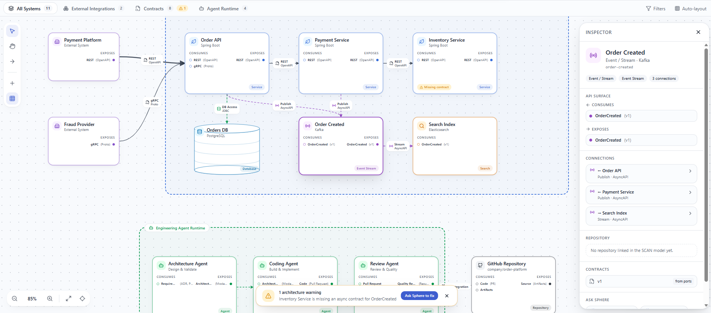

# SCAN (`scan-js`)

**System & Component Architecture Notation** - an open-source toolkit for describing and editing software architecture diagrams in the browser.



SCAN is an open-source **notation + embeddable libraries + reference modeler** for
system and component architecture diagrams - not a full product platform.

| Layer | Role in SCAN |
|-------|----------------|
| **Notation** | YAML/JSON metamodel (`scan: "0.1"`) - elements, ports, typed connections, views |
| **Libraries** | [`@spherescan/model`](https://www.npmjs.com/package/@spherescan/model), [`rules`](https://www.npmjs.com/package/@spherescan/rules), [`viewer`](https://www.npmjs.com/package/@spherescan/viewer), [`modeler`](https://www.npmjs.com/package/@spherescan/modeler), [`cli`](https://www.npmjs.com/package/@spherescan/cli) on [npm](https://www.npmjs.com/org/spherescan) |
| **Reference app** | `apps/whiteboard` - minimal modeler to exercise the toolkit |
| **Editor preview** | [`packages/vscode-scan`](packages/vscode-scan) — read-only VS Code / Cursor diagram preview (`spherescan.scan`) |

```bash
npm i @spherescan/model @spherescan/viewer
npx scan validate ./architecture.scan.yaml   # after: npm i -D @spherescan/cli
```

This repository (`scan-js`) is the open-source project. Contributions, issues, and roadmap here are about **SCAN**, not any proprietary host product.

---

## What SCAN is

SCAN describes **software systems**: services, data stores, event streams, external systems, agents, and repositories - plus **how they connect** (REST, gRPC, DB access, publish/subscribe, agent delegation, git integration).

Canonical form is **YAML** (JSON works with the same schema). A document has:

1. **Semantics** - root collections (`components`, `channels`, `connections`, ...)
2. **Presentation (diagram DI)** - `views[].layout` boxes and optional `boundaries`
3. **Validation** - Zod + JSON Schema in `@spherescan/model`, connection legality in `@spherescan/rules`

**Principle:** keep architectural **`type`** (role) separate from **`technology`** (stack), e.g. `type: service` + `technology: Spring Boot`.

Full normative detail: [`docs/spec/scan-0.1.md`](docs/spec/scan-0.1.md) · Whiteboard UI: [`docs/MANUAL.md`](docs/MANUAL.md) · JSON Schema: [`packages/model/schemas/scan-0.1.json`](packages/model/schemas/scan-0.1.json)

---

## How a SCAN document works

### Document root

```yaml
scan: "0.1"

system:
  id: order-platform
  name: Order Platform

components: [ ... ]
channels: [ ... ]
external_systems: [ ... ]
agents: [ ... ]
repositories: [ ... ]
connections: [ ... ]

views:
  - id: architecture-board
    layout: { ... }
    boundaries: [ ... ]
```

| Field | Required | Purpose |
|-------|----------|---------|
| `scan` | yes (`"0.1"`) | Notation version |
| `system` | yes | System `id` + `name` |
| `components` | no | Services, datastores, search indexes |
| `channels` | no | Event / stream topics |
| `external_systems` | no | Systems outside the modeled boundary |
| `agents` / `agent_runtimes` | no | Agents and their runtimes |
| `repositories` | no | Source/artifact repos as first-class nodes |
| `connections` | no | Typed edges between element ids |
| `views` | yes (>=1) | Diagram layout + boundaries |

### Where elements go

| Concept | Collection | Notes |
|---------|------------|--------|
| API / app service | `components` | `type: service` |
| Database | `components` | `type: datastore` |
| Search index | `components` | `type: search` |
| Kafka / topic / stream | `channels` | usually `type: event-stream` |
| Third-party system | `external_systems` | |
| Agent | `agents` | not under `components` |
| Git / artifact repo **node** | `repositories` | canvas element |
| Inline repo **ref** on a component | `repository:` field | path only - not a box |

### Ports

Elements talk through **`consumes`** (inbound) and **`exposes`** (outbound) ports:

```yaml
consumes:
  - id: api-in
    label: REST
    protocol: OpenAPI
exposes:
  - id: api-out
    label: REST
    protocol: OpenAPI
```

When a connection sets `fromPort` / `toPort`, rules require **expose -> consume**.

### Connections

```yaml
connections:
  - id: e1
    from: order-api
    to: orders-db
    type: database-access
    label: DB Access
    fromSide: b   # diagram DI only
    toSide: t
```

| Type | Meaning |
|------|---------|
| `synchronous-request` | Request/response (e.g. REST) |
| `grpc-request` | Synchronous gRPC-style call |
| `database-access` | Client -> datastore |
| `event-publication` | Producer -> channel |
| `event-subscription` | Channel -> consumer |
| `stream-consume` | Stream / topic consume |
| `agent-delegation` | Agent -> agent |
| `git-integration` | Agent/system -> repository |

**Which pairs are legal** (e.g. service->database yes, agent->database no) is enforced by `@spherescan/rules`, not by the schema alone. See connection rules in the [scan-notation skill](skills/scan-notation/connection-rules.md) and `packages/rules`.

### Views (diagram interchange)

Semantics stay in root collections. **Pixels live only under `views`:**

```yaml
views:
  - id: architecture-board
    type: service-architecture
    boundaries:
      - id: g-trust
        label: Order Platform
        kind: trust          # trust | runtime
        members: [order-api, orders-db]
        x: 400
        y: 60
        w: 900
        h: 500
    layout:
      order-api: { x: 480, y: 120, w: 260, h: 190 }
      orders-db: { x: 500, y: 380, w: 220, h: 160 }
```

Every element that should appear on the board needs a `layout` entry. Boundaries are optional grouping rectangles (trust / runtime).

### Minimal valid example

```yaml
scan: "0.1"

system:
  id: checkout
  name: Checkout

components:
  - id: checkout-api
    name: Checkout API
    type: service
    technology: NestJS
    exposes:
      - id: checkout-api-out
        label: REST
        protocol: OpenAPI

external_systems:
  - id: payments
    name: Payments Provider
    exposes:
      - id: payments-out
        label: REST

connections:
  - id: c1
    from: payments
    to: checkout-api
    type: synchronous-request
    label: REST

views:
  - id: board
    layout:
      checkout-api: { x: 320, y: 120, w: 260, h: 190 }
      payments: { x: 40, y: 120, w: 220, h: 150 }
```

Fixture used in tests: [`packages/model/fixtures/order-platform.yaml`](packages/model/fixtures/order-platform.yaml)

---

## Packages

Published on npm under [`@spherescan`](https://www.npmjs.com/org/spherescan) (`0.1.0`):

| Package | Purpose |
|---------|---------|
| [`@spherescan/model`](https://www.npmjs.com/package/@spherescan/model) | Parse / serialize / validate SCAN YAML & JSON |
| [`@spherescan/rules`](https://www.npmjs.com/package/@spherescan/rules) | Legal connection pairs + port checks |
| [`@spherescan/viewer`](https://www.npmjs.com/package/@spherescan/viewer) | Project model -> board graph; SVG/PNG export |
| [`@spherescan/modeler`](https://www.npmjs.com/package/@spherescan/modeler) | Command stack: move, connect, create, auto-layout, undo |
| [`@spherescan/cli`](https://www.npmjs.com/package/@spherescan/cli) | `validate`, `export svg`, ... |
| [`packages/vscode-scan`](packages/vscode-scan) | VS Code / Cursor read-only diagram preview (VSIX; not on npm) |
| `@spherescan/board` | Shared React canvas (**private** — not on npm in v0.1; used by the whiteboard) |

### Install

```bash
npm i @spherescan/model @spherescan/rules @spherescan/viewer @spherescan/modeler
npm i -D @spherescan/cli
```

Validate a diagram:

```bash
npx scan validate ./architecture.scan.yaml
```

Embed pattern (viewer):

```js
import { ScanViewer } from "@spherescan/viewer";

const viewer = new ScanViewer({ container: "#canvas" });
await viewer.importYAML(yamlString);
```

Modeler adds editing on top of the same model (command stack, create/connect/move, undo).

Public APIs prefer `Scan*` names (`ScanModel`, `ScanViewer`, `ScanModeler`, ...). Legacy `Sphere*` / `sphere:` aliases remain for compatibility; new code should use `Scan*` / `scan:`.

---

## Repository layout

```text
scan-js/
  packages/model|rules|viewer|modeler|cli|board
  apps/whiteboard                 # minimal reference UI
  examples/embed-viewer
  examples/embed-board            # host-page rehearsal for @spherescan/board
  examples/architectures          # sample .scan.yaml diagrams
  skills/scan-notation/           # reference AI skill (Apache 2.0)
  docs/spec/scan-0.1.md           # normative spec (CC BY 4.0)
  docs/MANUAL.md
  docs/api/walkthrough.md
  docs/DEVELOPMENT.md
  docs/BACKLOG.md
```

---

## Develop

```bash
npm install --legacy-peer-deps
npm run build
npm test
npm run validate          # CLI validate on the order-platform fixture
npm run dev               # reference whiteboard
```

When this tree is **nested under `sphere-io/`**, install once at the **monorepo root** (`sphere-io/`), not inside `scan-js/`. A second `node_modules` here (especially a second `react`) causes invalid hook / SSR crashes in the whiteboard and in Sphere. If both exist, remove `scan-js/node_modules` and reinstall from the parent.

Open the whiteboard, load a `.scan` / `.yaml` file, edit on canvas, save as SCAN YAML.

**Whiteboard how-to:** [`docs/MANUAL.md`](docs/MANUAL.md) · **Local setup:** [`docs/DEVELOPMENT.md`](docs/DEVELOPMENT.md) · **API walkthrough:** [`docs/api/walkthrough.md`](docs/api/walkthrough.md)

---

## Validate YAML from source (optional)

Prefer the published packages above. To run the CLI from a local clone:

```bash
npm install --legacy-peer-deps && npm run build
node packages/cli/dist/cli.js validate /path/to/architecture.scan.yaml
```

Optional global bin from this tree:

```bash
cd packages/cli && npm link
scan validate ./architecture.scan.yaml
```

Programmatic: `parseScanYaml` + `validateScanModel` from `@spherescan/model`. Publish notes: [`docs/PUBLISH.md`](docs/PUBLISH.md).

---

## Contributing

See **[CONTRIBUTING.md](CONTRIBUTING.md)** for setup, package boundaries, and PR expectations.

This project is **scan-js / SCAN**. Please file issues and PRs against this repository's scope (notation, `@spherescan/*`, whiteboard, CLI, docs). Product-specific chrome, branding, or proprietary hosts are out of scope here.

---

## Licensing

This repository uses different licenses for the SCAN specification and its
software implementations.

| Material | License |
|----------|---------|
| SCAN specification under `docs/spec/` | [CC BY 4.0](LICENSES/CC-BY-4.0.txt) |
| Schemas, packages, CLI and SDKs | [Apache License 2.0](LICENSE) |
| Reference modeler and examples | [Apache License 2.0](LICENSE) |
| Reference SCAN AI skill (`skills/scan-notation/`) | [Apache License 2.0](LICENSE) |

Unless a file states otherwise, source code and machine-readable artifacts are
licensed under the Apache License 2.0.

Host-editor configs (`.cursor`, `.claude`, Sphere product skills/plans/rules) are
**not** shipped in this repository. The only AI skill in-tree is
[`skills/scan-notation/`](skills/scan-notation/).

The names **SCAN**, **Sphere**, their logos, and the **SCAN Certified** designation
are not granted under these licenses. See [TRADEMARKS.md](TRADEMARKS.md).

CC BY permits commercial reuse and modification but requires credit, a license link, and an indication of changes. [Creative Commons explains those conditions here](https://creativecommons.org/licenses/by/4.0/). Apache 2.0 permits commercial use and redistribution, includes an explicit patent grant, and excludes automatic trademark rights. [Apache License 2.0](https://www.apache.org/licenses/LICENSE-2.0).
